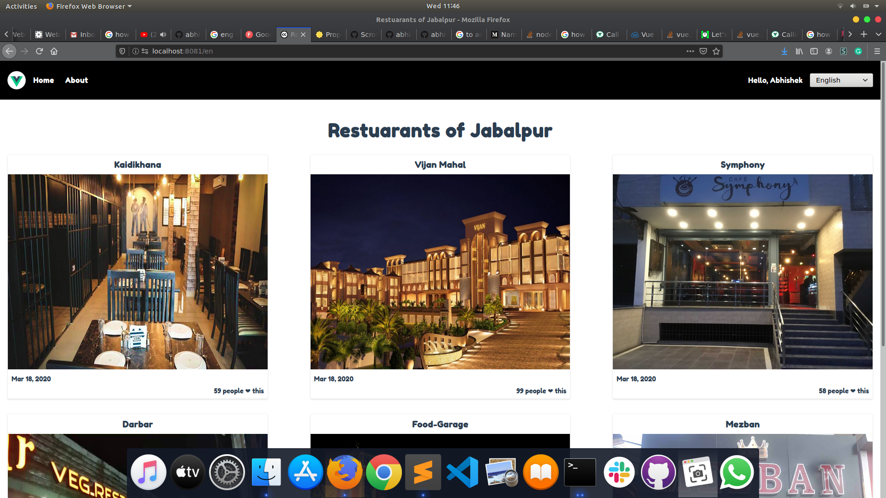
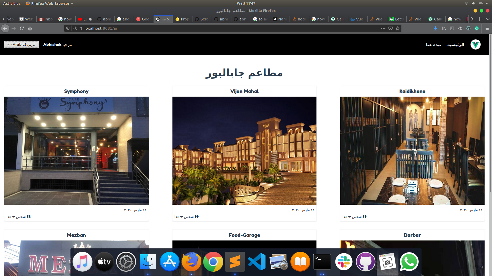

## RESTUARANTS OF JABALPUR (Internationalized)

App for some of the best Restuarants of Jabalpur,India. This App is being internationalized in 2 languages i.e English and Arabic. This will look this :)

## SCREENSHOTS :

```diff
+ ENGLISH HOME PAGE :

```


```diff
+ ARABIC HOME PAGE :

```


## GETTING STARTED

Run the following commands in order to have the code up and running on your machine:

``` bash
# installs dependencies
$ npm install

# Builds and serves assets with hot-reload
$ npm run serve
```

### Compiles and minifies for production

```
npm run build
```

### Lints and fixes files

```
npm run lint
```

### Customize configuration

See [Configuration Reference](https://cli.vuejs.org/config/)
